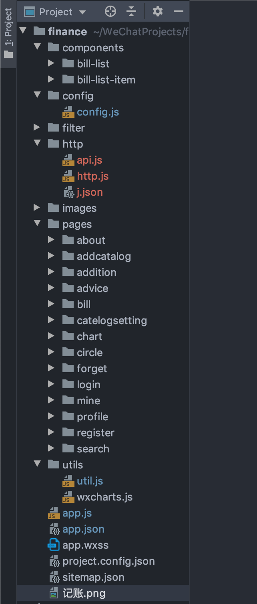

# 微信小程序项目：记账小程序
这是理财系统的前端,江苏海洋大学微信小程序比赛
### 1. 项目描述
	(1). 此项目为记账小程序
	(2). 包括账单、图表、搜索、用户等多个子模块
	(3). 使用微信小程序技术 
	(4). 采用模块化、组件化、工程化等模式开发
### 2. 项目功能界面

在 1.0.2版本中删除了扇形图
### 3. 项目目录


        * pages：页面
        * components：组件
        * utils：工具类  
            |-- util.js：工具类 
            |-- wxcharts.js：图表插件
        * images：资源图片
        * config：配置文件
        * filter：过滤器
        * http：网络请求
            |-- http.js：对 wx.request 的封装
            |-- api.js：对网络请求接口的封装    

### 4. 请求封装
一开始使用 wx.request 对数据进行网络请求，可写完后，发现太过冗余，也太麻烦，故对其做了封装。
通过创建一个函数返回 Promise 对象，就可以屏蔽公共的部分
```javascript
// http/http.js
/**
 * 对微信普通网络请求封装
 * @param url   请求地址
 * @param data  请求的参数
 * @param method   请求的方法类型 
 * @param headers   头部信息，在这里主要是 token 认证功能
 * @returns {Promise<unknown>} 返回请求的 Promise 对象
 */
function http({url, data, method, headers = {}}) {
    return new Promise((resolve, reject) => {
        wx.request({
            url,
            method,
            data,
            header: {
                Authorization: headers.token,
                expiresIn: headers.expiresIn
            },
            success: (result) => {
                const res = result.data;
                if (res.code === 0) {
                    resolve(res.data);
                } else if (res.code === 1) {
                    reject(res.msg);
                }
                // 隐藏 loading
                wx.hideLoading();
            },
            fail: (err) => {
                console.error('server error', err);
            }
        });
    })
}

/**
 * 对文件上传接口封装
 * @param url   请求地址
 * @param fileOptions   文件配置项
 * @param data  请求发送的数据
 * @param headers   头部信息，在这里主要是 token 认证功能
 * @returns {Promise<unknown>}  返回请求的 Promise 对象
 */
function uploadFile({url, fileOptions, data, headers = {}}) {
    return new Promise(((resolve, reject) => {
        wx.uploadFile({
            url: url,
            filePath: fileOptions.filePath,
            name: fileOptions.name || 'file',
            header: {
                Authorization: headers.token,
                expiresIn: headers.expiresIn
            },
            formData: data,
            success: (res) => {
                console.log(res.data);
                if (JSON.parse(res.data).code === 0) {
                    resolve(res.data);
                } else if (res.code === 1) {
                    reject(res.msg);
                }
            },
            fail: (err) => {
                console.error('server error', err);
            }
        })
    }))
}

module.exports = {
    http,
    uploadFile
};
```

### 5. 遇到的问题
    (1). 在更新账单数据后，如何更新账单界面的数据？
            这个问题我的解决方案是，在 globalData 中添加一个全部变量 isRefreshBills，默认为 false，
         当更新账单数据成功后，将 isRefreshBills 修改为 true，同时返回到账单界面，在账单界面的
         onShow()方法中，判断 isRefreshBills 是否为 true，若为 true 则重新请求数据，同时将 isRefreshBills 
         设为 false，否则不请求。这样就避免了没有更新数据的情况下多次请求数据。
            对这个解法，还有一种更加节流的方法，就是更新后不去请求，而是对原来的获取到的数据进行个别删除。比如当
         更新数据成功后，获取一个被更新的这条数据的id，然后在账单页面的 onShow() 方法中，遍历找到这个 id 对应的
         数据，并删除这条数据也能达到数据更新的效果
         
    (2). 在进行类别添加的时候，自定义的类别会出现双倍？
            由于我有一分部初始数据是存在 globalData 中的，每次从服务器获取自定义类别时，都会对其进行拼接，
         在拼接的时候修改了原来的 globalData 中的值，所以每次添加后都会请求一次自定义数据，进行拼接。
         解决方案：禁止更新 globalData 中的数据
         
    (3). 返回哪个页面问题？
            在账单页面可以进去修改账单的页面，在搜索页面也可以进入修改账单账单的页面，他们用的是同一个组件，
         那么如何保证在账单页面进入修改账单页面后返回到账单页面，在搜索页面进入修改账单页面后返回到搜索页面。
         首先在路由跳转的时候添加当前路由信息，然后在修改账单页面中接受这个路由信息，最后通过这个路由信息返回到原来的路由
         
### 6. 总结
        这个项目是我5月份参加学校微信小程序的项目，两个礼拜仓促的做了这么一个项目，前后端都有，最后荣获一等奖。在之前比赛用的版本中
    其实有很多的 bug 以及卡顿现象居多，故这两天我有对这个项目进行了一定的维护，发现原来的代码实在惨不忍睹，现在经过升级，页面卡顿现象减少，
    若后期再想维护，也相对于之前的版本好维护多了，但是还有很多可以维护的空间。其实我并不对这个项目很满意，比如之前我没做分页加载，
    现在想加个分页加载的功能，我发现并不是一下子就能搞定的，因为我的数据结构不是很合理，因为后端返回的数据和前端要显示的数据格式是不一致，
    故前端要重新定义数据结构，所以对分页来说就有一定的困难。在我对项目进行维护后，代码比以前更简洁，可读性相对于之前的版本来说要更加好。

